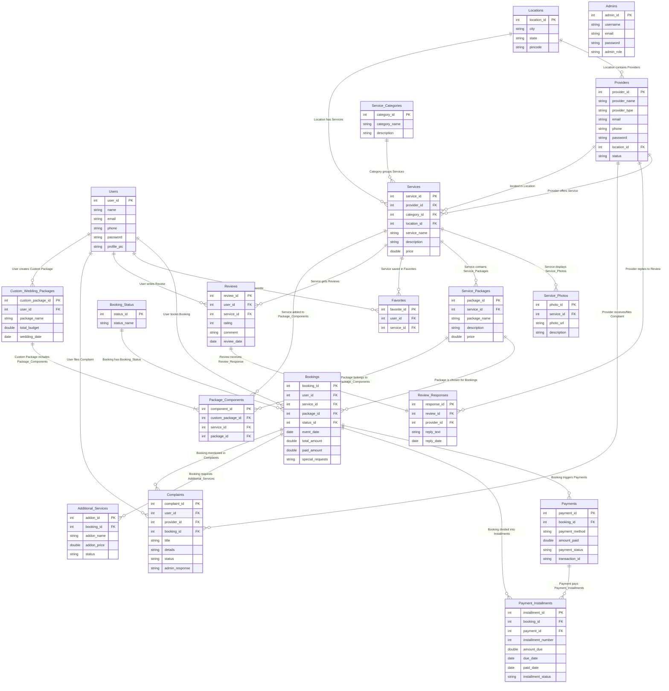

# ShaadiSpot - On The Spot: College Project Database Design Report

This report contains the Database Design, Entity-Relationship (ER) Diagram, Relational Schema, and MySQL table structures for the college project **“ShaadiSpot - On The Spot”** (a wedding service booking web application).

---

## 1. Simplified Entity-Relationship (ER) Diagram

This diagram displays every table (entity) along with all its attributes (columns). Primary Keys are marked as **PK** and Foreign Keys are marked as **FK**.

---

## 2. Relational Schema (Table Layouts)

Here is how the tables are connected in the database:

*   **Users** (`user_id`, name, email, phone, password, profile_pic)
*   **Locations** (`location_id`, city, state, pincode)
*   **Providers** (`provider_id`, provider_name, provider_type, email, phone, password, *location_id*, status)
*   **Service_Categories** (`category_id`, category_name, description)
*   **Services** (`service_id`, *provider_id*, *category_id*, *location_id*, service_name, description, price)
*   **Service_Photos** (`photo_id`, *service_id*, photo_url, description)
*   **Service_Packages** (`package_id`, *service_id*, package_name, description, price)
*   **Booking_Status** (`status_id`, status_name)
*   **Bookings** (`booking_id`, *user_id*, *service_id*, *package_id*, *status_id*, event_date, total_amount, paid_amount, special_requests)
*   **Payments** (`payment_id`, *booking_id*, payment_method, amount_paid, payment_status, transaction_id)
*   **Payment_Installments** (`installment_id`, *booking_id*, *payment_id*, installment_number, amount_due, due_date, paid_date, installment_status)
*   **Reviews** (`review_id`, *user_id*, *service_id*, rating, comment, review_date)
*   **Review_Responses** (`response_id`, *review_id*, *provider_id*, reply_text, reply_date)
*   **Favorites** (`favorite_id`, *user_id*, *service_id*)
*   **Complaints** (`complaint_id`, *user_id*, *provider_id*, *booking_id*, title, details, status, admin_response)
*   **Additional_Services** (`addon_id`, *booking_id*, addon_name, addon_price, status)
*   **Custom_Wedding_Packages** (`custom_package_id`, *user_id*, package_name, total_budget, wedding_date)
*   **Package_Components** (`component_id`, *custom_package_id*, *service_id*, *package_id*)
*   **Admins** (`admin_id`, username, email, password, admin_role)

*(Note: Underlined fields are Primary Keys, and italicized fields are Foreign Keys.)*

---

## 3. Relationship Explanations (Plain English)

These are simple explanations of how the tables interact, perfect for viva questions:

1.  **User books Booking (1 to Many):** One registered user can make many service bookings, but each booking belongs to only one user.
2.  **Provider offers Service (1 to Many):** A single business provider (like a hotel owner) can create and offer multiple services, but each service is managed by that provider.
3.  **Service contains Service_Packages (1 to Many):** A service (like catering) can have multiple price packages (like Gold Menu, Platinum Menu), but a package belongs to only one service.
4.  **Service displays Service_Photos (1 to Many):** A service can have multiple photos in its gallery, but each photo is uploaded for that specific service.
5.  **Location has Providers/Services (1 to Many):** A location (like Mumbai) can contain multiple providers and services, making search filters simple.
6.  **User writes Review / Service gets Reviews (1 to Many):** A user can write reviews on multiple services. A service can collect ratings and reviews from different users.
7.  **Review receives Review_Response (1 to 1):** A review written by a user can only have at most one official reply from the provider of that service.
8.  **Booking triggers Payments (1 to Many):** A booking can have multiple payment attempts (e.g. initial installment, final payment, or a failed transaction attempt).
9.  **Booking divided into Payment_Installments (1 to Many):** To make pricing easy, a booking's total amount can be split into multiple installment cards (e.g. 1st installment, 2nd installment).
10. **Booking requests Additional_Services (1 to Many):** A customer can request extra customizations or addon items (like late check-out or extra flowers) on their booking.
11. **User creates Custom_Wedding_Packages (1 to Many):** A user can build their own custom dream package boards (e.g., "My Beach Wedding") where they group various services.
12. **Custom_Wedding_Packages includes Package_Components (1 to Many):** A custom package board contains list entries pointing to specific services or packages.
13. **User files Complaint (1 to Many):** A user can submit multiple dispute complaints to the admin support team.

---

## 4. Viva Cheat Sheet (BSc IT Viva Questions)

*   **Q: What is a Primary Key (PK)?**
    *   **A:** It is a unique column (like `user_id` or `booking_id`) that uniquely identifies every single row in a database table. It cannot be empty (Null) and cannot repeat.
*   **Q: What is a Foreign Key (FK)?**
    *   **A:** It is a column in one table that links to the Primary Key of another table (for example, `user_id` inside the `Bookings` table). It represents a connection or relationship between two tables.
*   **Q: What is Normalization?**
    *   **A:** It is the process of organizing database tables to reduce data redundancy (avoiding duplicate info) and improve data integrity (preventing errors during INSERT/UPDATE/DELETE).
